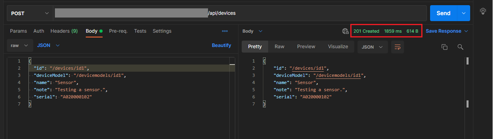
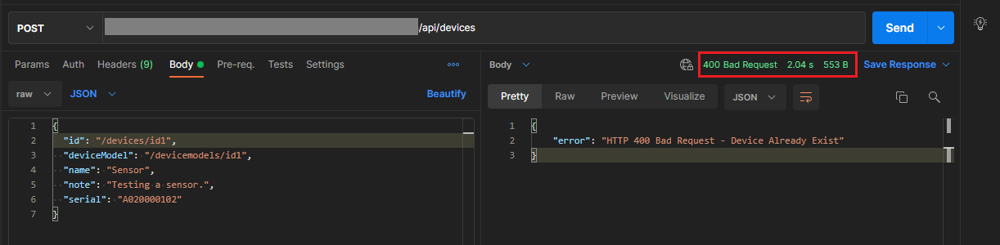
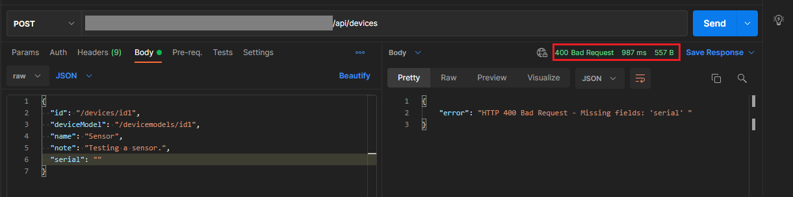
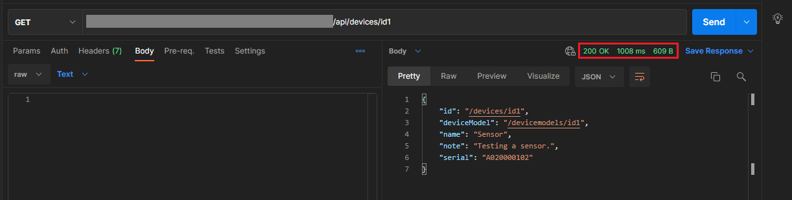
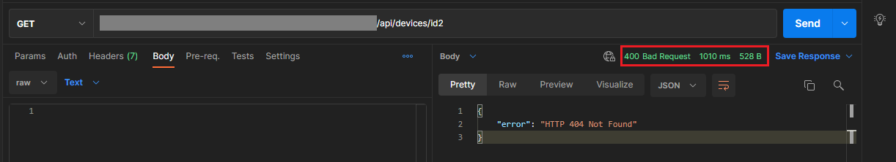

# Go Challenge
Simple Restful API on AWS

# Project Description

Implement a simple Restful API on AWS using the following tech stack:

 * Serverless Framework (https://serverless.com/) 
 * Go language (https://golang.org/) 
 * AWS API Gateway
 * AWS Lambda
 * AWS DynamoDB

The API should accept the following JSON requests and produce the corresponding HTTP responses:

### Request 1:
```
HTTP POST
URL: https://<api-gateway-url>/api/devices
Body (application/json):
{
  "id": "/devices/id1",
  "deviceModel": "/devicemodels/id1",
  "name": "Sensor",
  "note": "Testing a sensor.",
  "serial": "A020000102"
}
```

#### Response 1 - Success:
```
HTTP 201 Created
Body (application/json):
{
  "id": "/devices/id1",
  "deviceModel": "/devicemodels/id1",
  "name": "Sensor",
  "note": "Testing a sensor.",
  "serial": "A020000102"
}
```

#### Response 1 - Failure 1:
```
HTTP 400 Bad Request
```

If any of the payload fields are missing. Response body should have a descriptive error message for the client to be able to detect the problem.

#### Response 1 - Failure 2:
```
HTTP 500 Internal Server Error
```

If any exceptional situation occurs on the server side.

### Request 2:
```
HTTP GET
URL: https://<api-gateway-url>/api/devices/{id}
Example: GET https://api123.amazonaws.com/api/devices/id1
```

#### Response 2 - Success:
```
HTTP 200 OK
Body (application/json):
{
  "id": "/devices/id1",
  "deviceModel": "/devicemodels/id1",
  "name": "Sensor",
  "note": "Testing a sensor.",
  "serial": "A020000102"
}
```

#### Response 2 - Failure 1:
```
HTTP 404 Not Found
```

If the request id does not exist.

#### Response 2 - Failure 2:
```
HTTP 500 Internal Server Error
```

If any exceptional situation occurs on the server side.

# Deployment
## Structure
 * ```build```
    * ```main.zip``` final build file
 * ```cmd```
    * ```main.go``` main file that project started from
 * ```pkg```
    * ```device```
        * ```device.go``` functions communicate with dynamodb
        * ```device_test.go``` all main functions test
    * ```handlers```
        * ```handlers.go``` functions that connect user request to dynamodb functions
        * ```api_response.go``` creating proper response

## Requirements
 * aws cli: aws msi installer: https://s3.amazonaws.com/aws-cli/AWSCLI64.msi
 * go: https://go.dev/dl/go1.18.windows-amd64.msi
 * build-lambda-zip: 
    - set GO111MODULE=on
	- go install github.com/aws/aws-lambda-go/cmd/build-lambda-zip@latest
 * serverless: npm install -g serverless

## Deploying
Create a Makefile in project folder to write deploy commands in it.
 * deploy:
	- export GOARCH=amd64
	- export GOOS=linux
	- go build -ldflags="-s -w" -o build/main cmd/main.go
	- build-lambda-zip -o build/main.zip build/main
	- sls deploy
I am using windows 10 to deploy project, so i replace "build" with "deploy" command and "set" with "export" command in make file.

# Output
I use postman to test routes output.

### Create Device




### Get Device



# Test
In ```device``` folder, ```device_test.go``` consists of all main functions unit test. I also use coverage test command to generate a html file output to visually show coverage unit test area.

```
PASS
coverage: 87.2% of statements
ok      github.com/azinmirbostani/go-challenge/pkg/device       0.781s
```
